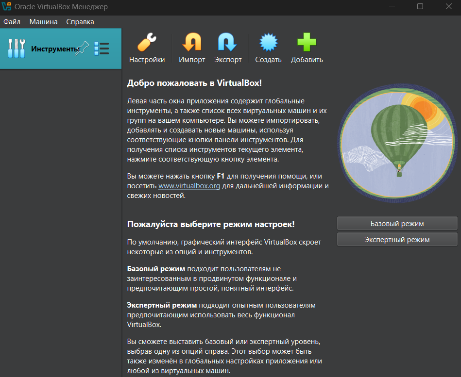
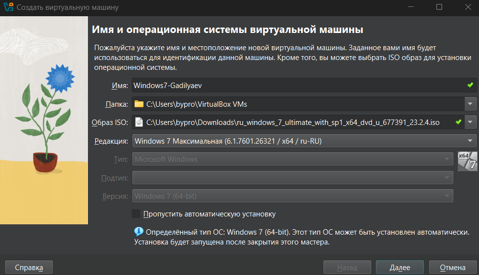
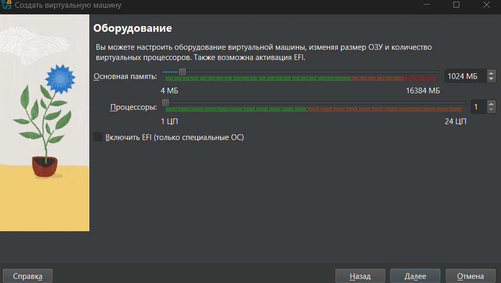
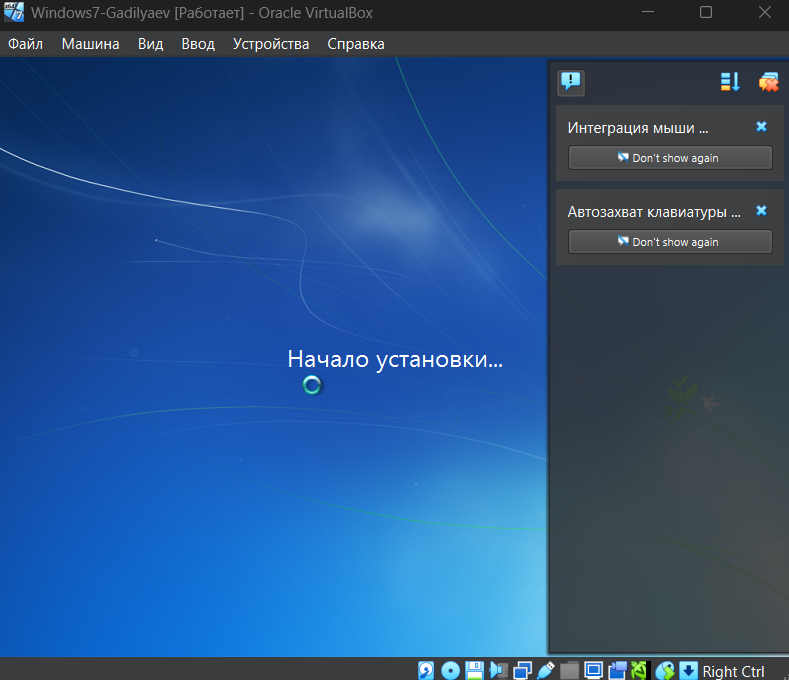
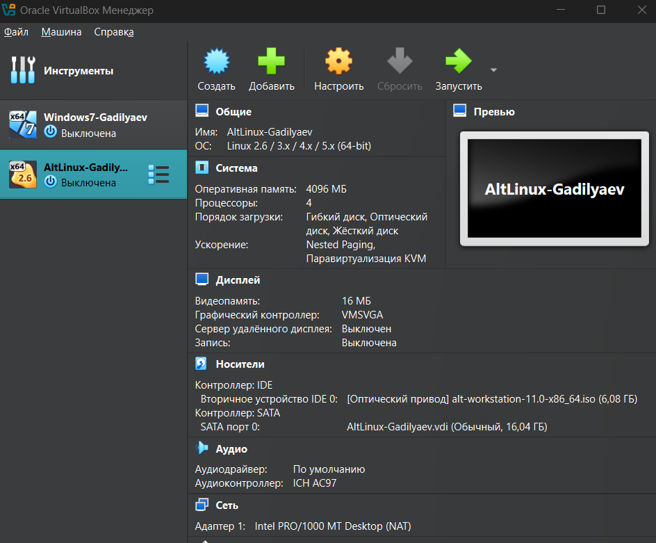

# Практическое занятие №1

## Тема
Использование сервисных программ поддержки интерфейсов. Настройка рабочего стола

## Цель
Изучение основных понятий о виртуальных машинах для их практического применения.

## Оборудование
Компьютер в сборе с программным обеспечением или испытательный стенд.

## Ход работы
1. Ознакомиться с теоретической частью.
2. Выполнить задания.
3. Ответить на контрольные вопросы.
4. Оформить отчет.

## Практические задания
1. Установить ORACLE VirtualBox в папку `D:\VirtualBox`.
2. Запустить программу на исполнение.

3. Создать виртуальную машину для установки ОС Windows 7.
4. Указать имя (`Windows7-[ваша_фамилия]`), тип и версию (нужное выбрать из списка).

5. Указать объем оперативной памяти 1024 МБ.

6. Создать новый виртуальный жесткий диск типа VDI.
7. Указать формат хранения «Динамический виртуальный жесткий диск».
8. Указать размер жесткого диска 16 ГБ.
9. Результат создания в виде скриншота приложить к отчету.

10. Самостоятельно создать виртуальную машину для установки ОС Linux Alt Master 2.4 со следующими параметрами: ОЗУ 128 МБ, HDD – динамический 2 ГБ. Результат в виде скриншота отобразить в отчете.

## Контрольные вопросы
1. **Что называется виртуальной машиной?**  
   Виртуальная машина — программная или аппаратная среда, исполняющая некоторый код (например, байт-код, шитый код, p-код или машинный код реального процессора), или спецификация такой системы (например: «виртуальная машина языка программирования Си»).

2. **Какие преимущества у виртуальной машины? Какие недостатки?**  
   **Преимущества:**
    - Возможность работать одновременно в нескольких системах, осуществлять сетевое взаимодействие между ними;
    - Возможность сделать «снимок» текущего состояния системы и содержимого дисков одним кликом мыши, а затем в течение очень короткого промежутка времени вернуться в исходное состояние;
    - Простота создания резервной копии операционной системы (не надо создавать никаких образов диска, всего лишь требуется скопировать папку с файлами виртуальной машины);
    - Возможность иметь на одном компьютере неограниченное число виртуальных машин с совершенно разными операционными системами и их состояниями;
    - Отсутствие необходимости перезагрузки для переключения в другую операционную систему.  
      **Недостатки:**
    - Потребность в наличии достаточных аппаратных ресурсов для функционирования нескольких операционных систем одновременно;
    - Операционная система работает несколько медленнее в виртуальной машине, нежели на «голом железе»;
    - Существуют методы определения того, что программа запущена в виртуальной машине (в большинстве случаев, производители систем виртуализации сами предоставляют такую возможность). Вирусописатели и распространители вредоносного программного обеспечения в курсе этих методов и включают в свои программы функции обнаружения факта запуска в виртуальной машине, при этом никакого ущерба вредоносное ПО гостевой системе не причиняет;
    - Различные платформы виртуализации пока не поддерживают полную виртуализацию всего аппаратного обеспечения и интерфейсов. В последнее время количество поддерживаемого аппаратного обеспечения стремительно растет у всех производителей платформ виртуализации. Помимо основных устройств компьютера, уже поддерживаются сетевые адаптеры, аудиоконтроллеры, интерфейс USB 2.0, контроллеры портов COM и LPT и приводы CD-ROM. Но хуже всего обстоят дела с виртуализацией видеоадаптеров и поддержкой функций аппаратного ускорения трехмерной графики.

3. **Чем отличается системная виртуальная машина от процессорной?**  
   Процессная виртуальная машина предназначена для поддержки процесса, создаётся при его активации и «умирает» после его окончания, а системная виртуальная машина – полнофункциональная, постоянно действующая системная среда, служащая для поддержки операционной системы вместе с большим количеством её пользовательских процессов.

4. **Какие существуют подходы к созданию интерфейсов между виртуальными машинами и системами виртуализации ресурсов?**  
   Подходы к созданию интерфейсов между виртуальными машинами и системами виртуализации:
    - **Полная виртуализация** – эмуляция "железа", гостевая ОС работает без изменений (VirtualBox, VMware).
    - **Паравиртуализация** – гостевая ОС оптимизирована для работы с гипервизором (Xen).
    - **Контейнеризация** – нет полной виртуализации, только изолированные процессы (Docker, LXC).
    - **Аппаратное ускорение** – поддержка виртуализации на уровне процессора (Intel VT-x, AMD-V).

5. **Какие существуют виртуальные машины? В чем их отличие друг от друга?**  
   Популярные программы виртуализации:
    - **Oracle VirtualBox** – бесплатная, поддерживает Windows, Linux, macOS, проста в использовании, позволяет делать "снимки" системы.
    - **Windows Virtual PC** – работает только с Windows, удобна для тестирования старых версий ОС от Microsoft.
    - **VMware Workstation** – платная, мощная, подходит для корпоративного использования, поддерживает Windows и Linux, имеет продвинутые сетевые настройки.
    - **VMware Player** – бесплатная версия VMware, но не может создавать виртуальные машины, только запускать уже готовые.
    - **Hyper-V** – встроен в Windows, предназначен для серверов и корпоративного использования.
    - **Docker, LXC** – контейнерные технологии, изолируют процессы без эмуляции ОС, используются для разработки и развертывания приложений.  
      **Отличия:** VirtualBox – удобна и бесплатна, VMware Workstation – надежна и функциональна, Hyper-V – интегрирована в Windows, Docker – работает без полноценной эмуляции ОС.