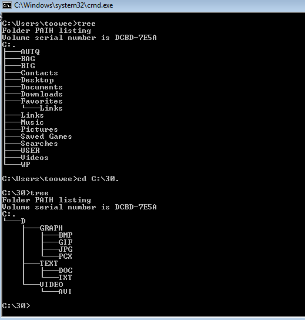
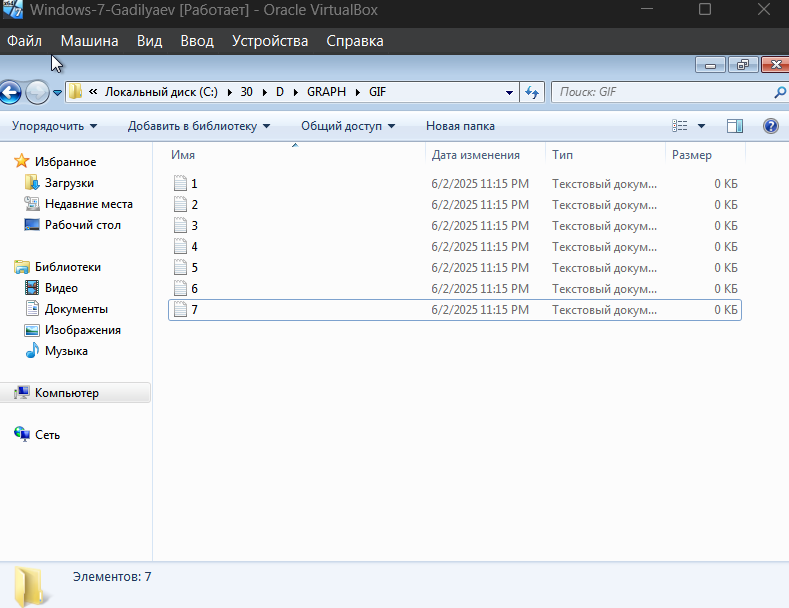
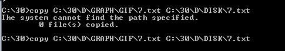
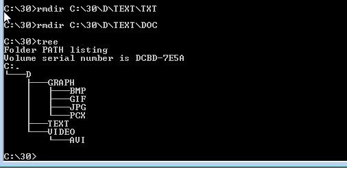
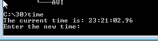
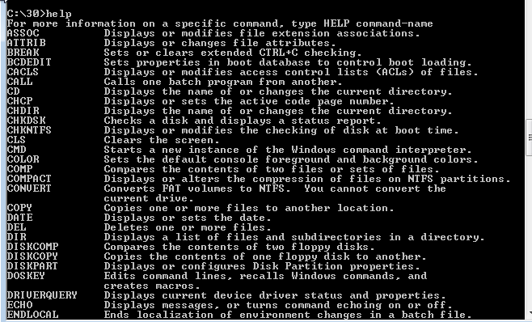
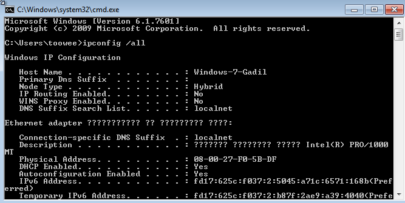
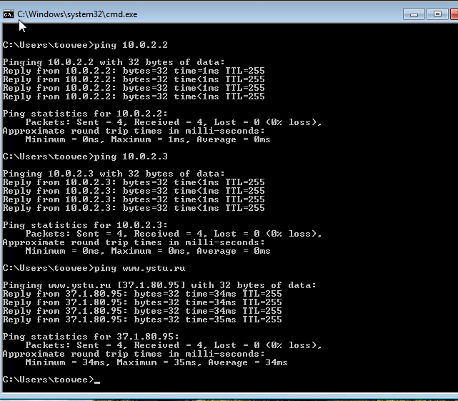
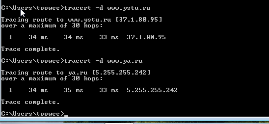
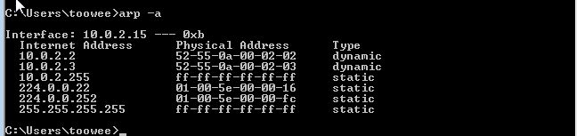

# Практическая работа №11

## Тема
Работа с командами в операционной системе. Использование команд работы с файлами, каталогами и дисками. Сетевая диагностика

## Цель работы
Изучить встроенные утилиты Windows для работы с файловой системой и диагностики сетевых подключений

## Ход работы
- Ознакомиться с краткими теоретическими сведениями.
- Выполнить задания.
- Ответить на контрольные вопросы.
- Оформить отчет.

1. Работа с файлами и каталогами 
    
    
    
    
    
    
2. ipconfig
    
3. ping
    
4. tracert
    
5. arp
    

    
    

