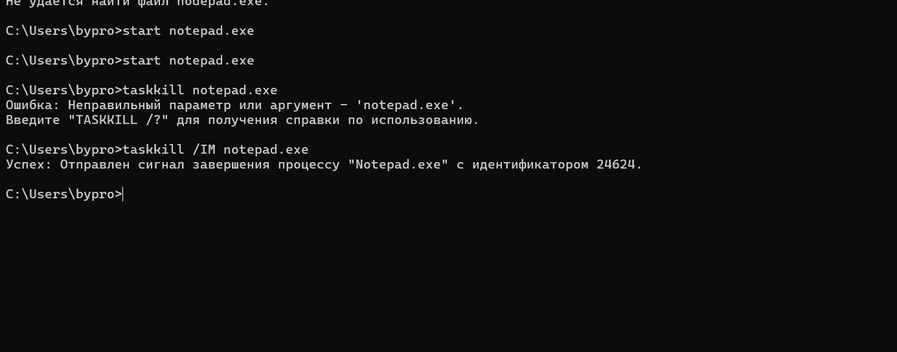

# Практическая работа №2

## Цель
Изучить структуру, возможности работы с диспетчером задач.

## Ход работы
1. Изучить теоретический материал.
2. Выполнить практические задания.

## Практическая часть

### Задание 1. Работа с Диспетчером задач Windows 7
- Ознакомиться с интерфейсом и функционалом Диспетчера задач Windows 7.
- Изучить вкладки: "Приложения", "Процессы", "Службы", "Производительность", "Сеть", "Пользователи".
- Выполнить анализ запущенных процессов и их характеристик (потребление памяти, ЦП и т.д.).

### Задание 2. Командная строка Windows
- Запустите программу «Блокнот»: C:\Windows > start notepad.exe, отследите выполнение процесса: C:\Windows > tasklist Затем завершите выполнение процесса: C:\Windows > taskkill /IM notepad.exe

- Самостоятельно, интуитивно, найдите команду запуска программы WordPad. Необходимый файл запуска найдите в папке Windows.

### Задание 3. Командная строка Windows
- Составить ход работы с диспетчером задач Windows 10/11 
- Отследите выполнение процесса explorer.exe при помощи диспетчера задач и командной строки
- Продемонстрируйте преподавателю завершение и повторный запуск процесса explorer.exe из Диспетчера задач и cmd

