# Практическая работа №3

## Цели
- Уметь настраивать операционную систему Windows.
- Уметь проверять поверхность дисков, проводить дефрагментацию дисков.
- Устанавливать параметры автоматического обновления системы.
- Устанавливать новые устройства.

## Настройка операционной системы Windows

### Задание 1. Просмотр шрифтов
1. Дважды щелкнуть по значку **Шрифты** на Панели управления.
2. Двойной щелчок по названию шрифта.
3. Просмотреть 5–6 различных шрифтов.
4. После просмотра шрифта окно закрыть.

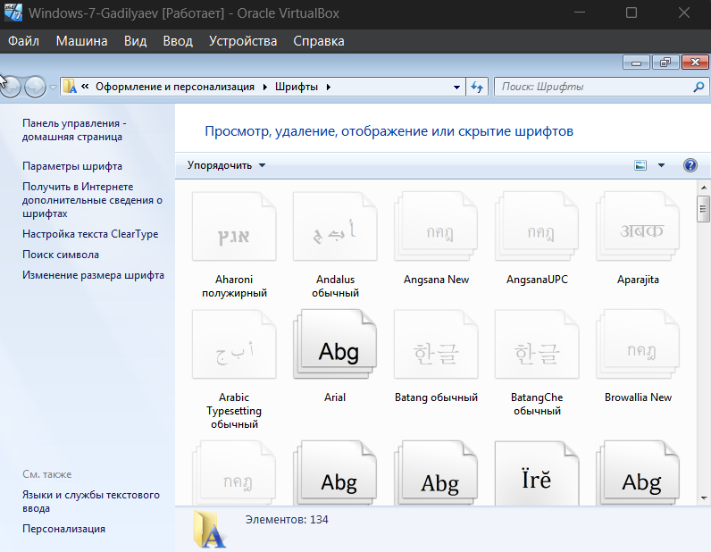

### Задание 2. Настройки фона рабочего стола
1. Дважды щелкнуть по значку **Экран** на Панели управления.
2. Щелкнуть по вкладке **Фон**.
3. Выбрать рисунок из списка **Рисунок** (например, **Облака**). Щелкнуть по кнопке **ОК**.
4. Переключатель **Размножить** позволяет размножать выбранный рисунок и покрыть рабочий стол копиями рисунка. Переключатель **По центру** позволяет разместить рисунок в центре рабочего стола.
5. Если рисунок не задан или расположен в центре рабочего стола, то поверхность рабочего стола можно заполнить узором, который выбирается в списке **Фоновый узор**.
6. Вернуть фон Рабочего стола в исходное состояние.

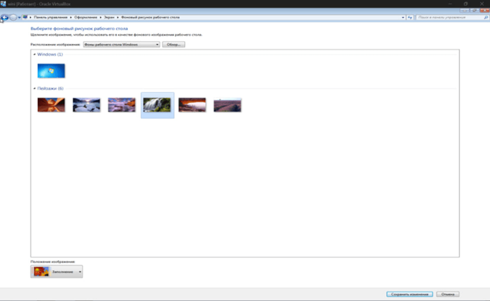

### Задание 3. Выбор и настройка экранной заставки
1. Дважды щелкнуть по значку **Экран** на Панели управления.
2. Щелкнуть по вкладке **Заставка**.
3. В поле **Заставка** выбрать любую заставку. Для просмотра заставки щелкнуть по кнопке **Просмотр**.
4. По окончании просмотра выбрать тип заставки – **Нет**. Щелкнуть по кнопке **ОК**.
5. Выберите в поле **Заставка** **Объемный текст**. Нажмите кнопку **Настройка**. Выберите пункт **Текст** (черная точка должна стоять в круге рядом со словом **Текст**). В поле справа введите номер своей группы. Размер, разрешение, поверхность, скорость и стиль движения настройте по своему усмотрению. Нажмите **ОК**.
6. Нажмите кнопку **Просмотр**. Просмотрите результат.

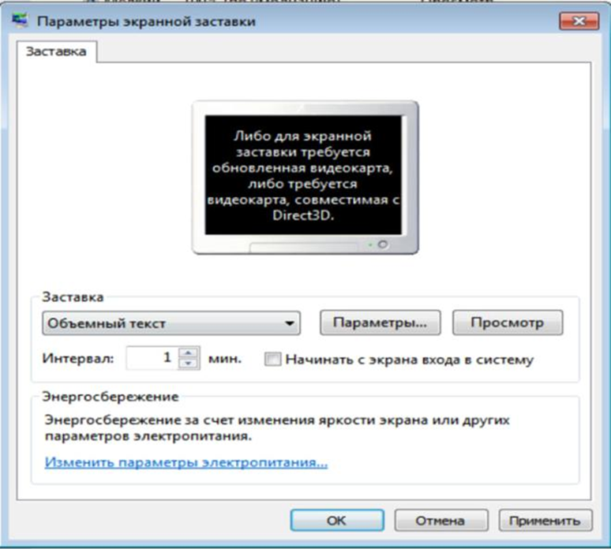

### Задание 4. Настройка схемы оформления рабочего стола
1. Дважды щелкнуть по значку **Экран** на Панели управления.
2. Щелкнуть по вкладке **Оформление**.
3. Элемент оформления выбирается в списке **Элемент**. Выбрать **Рабочий стол**.
4. Выбрать в списке схему оформления **Дождливый день**. Щелкнуть по кнопке **ОК**.
5. Выбрать произвольную схему оформления.
6. По окончании просмотра выбрать схему оформления **Стандартная Windows**.

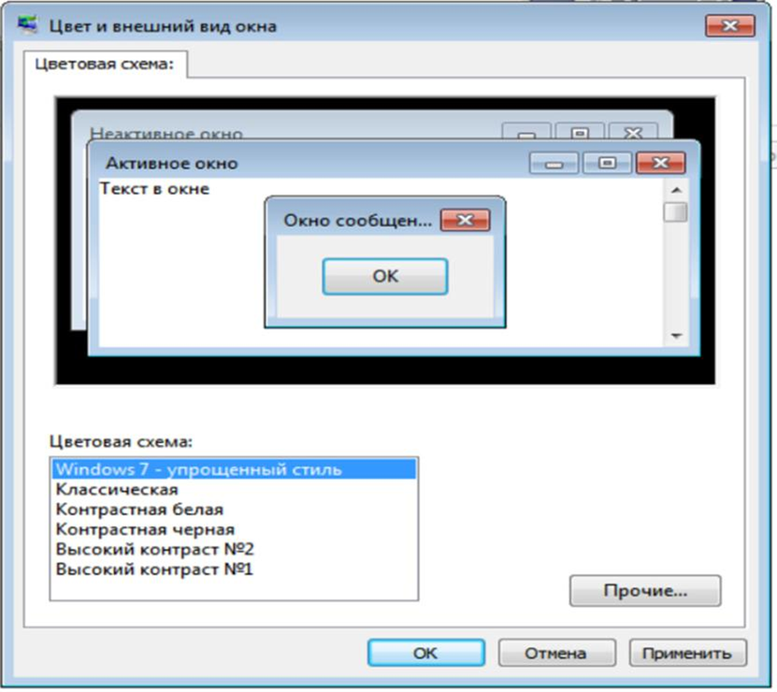

### Задание 5. Изменение размера и положения Панели задач
1. Изменить размер Панели задач: поместить указатель мыши на ее верхний край, чтобы он принял вид двунаправленной стрелки. Нажать левую кнопку мыши и, не отпуская ее, перетащить верхний край Панели задач вверх. Максимальная ширина Панели задач не может превышать половину экрана.
2. Вернуть Панель задач в исходное состояние.
3. Поместить Панель задач сбоку экрана: перетащить ее мышью.
4. Щелкнуть правой кнопкой мыши на Панели задач. В появившемся меню выбрать команду **Свойства**.
5. Установить флажок **Автоматически убирать с экрана**. Щелкнуть мышью по кнопке **ОК**.
6. Вернуть Панель задач в исходное состояние.

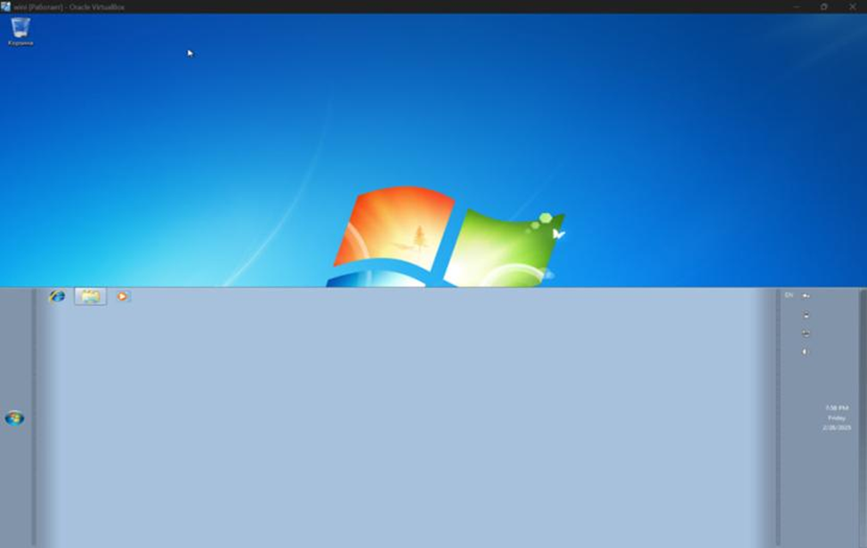
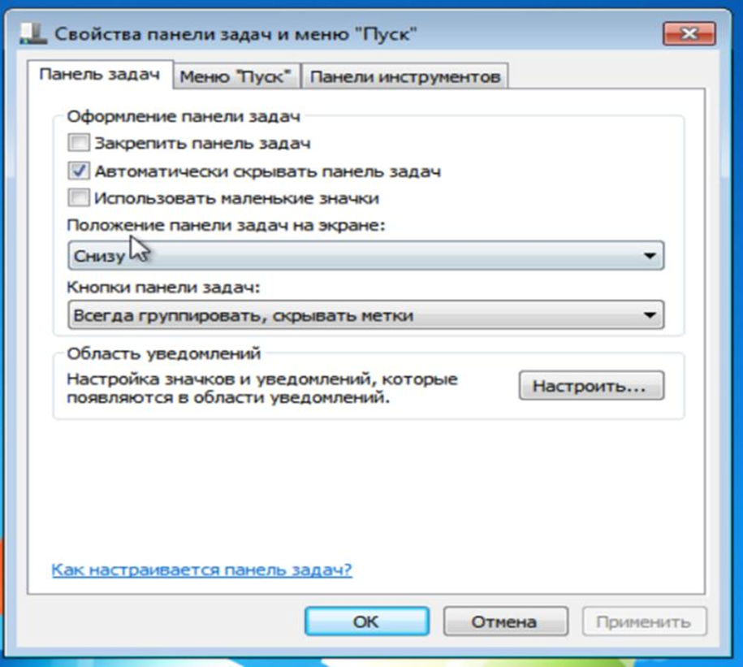

### Задание 6. Настройка оформления Рабочего стола
1. Выберите в контекстном меню пункт **Свойства** – откроется диалоговое окно **Свойства: Экран**. Откройте вкладку **Рабочий стол**.
2. В списке **Фоновый рисунок** выберите рисунок **Японский мотив**. Щелкните на кнопке **ОК**. Убедитесь в том, что фон Рабочего стола изменился.
3. Повторите пункты 2–3, изменяя на вкладке **Рабочий стол** способ расположения фонового рисунка с помощью раскрывающегося списка **Расположение**. Установите, как влияют на оформление экрана способы **По центру**, **Замостить** и **Растянуть**.
4. Повторите пункты 2–3, выбрав в качестве фонового рисунка объект **Безмятежность** и способ расположения **Растянуть**.
5. Закройте все открытые окна.

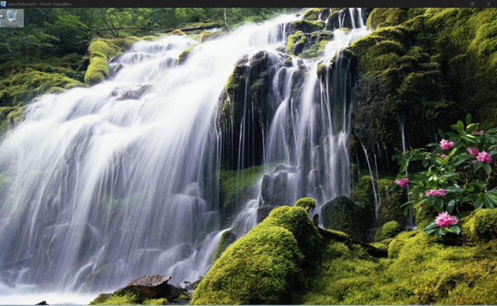

### Задание 7. Проверка рабочих поверхностей дисков
1. Открыть меню **Свойства** контекстного меню диска **А:**.
2. Перейти на вкладку **Сервис**.
3. Нажать кнопку **Выполнить проверку**.
4. Просмотреть отчёт.

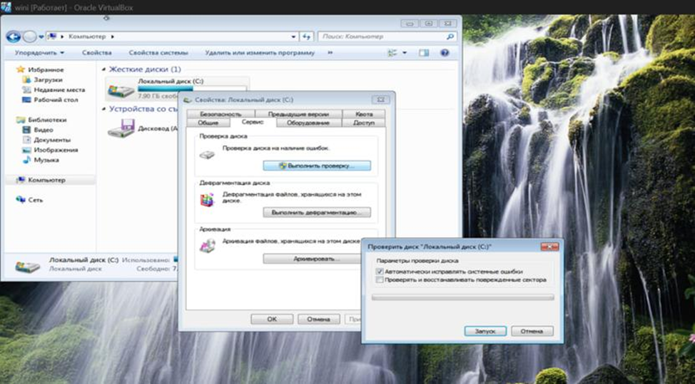

### Задание 8. Дефрагментация диска
1. Открыть меню **Свойства** контекстного меню диска **А:**.
2. Перейти на вкладку **Сервис**.
3. Нажать кнопку **Выполнить дефрагментацию**.

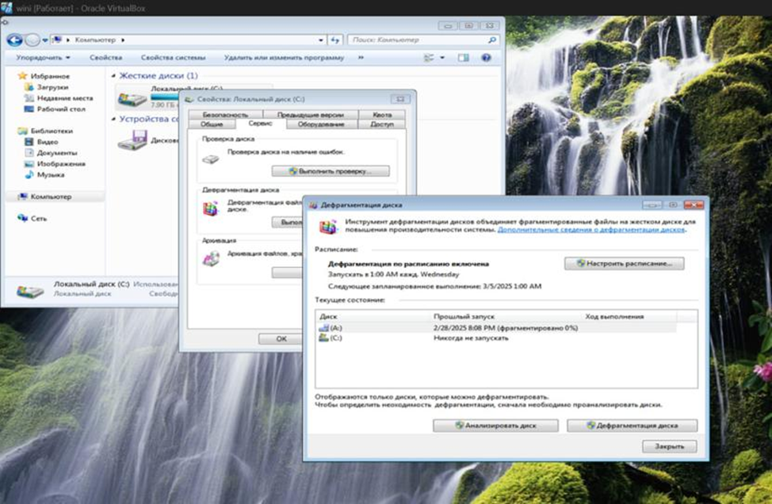

### Задание 9. Просмотр сведений о системе
1. **Пуск** – **Все программы** – **Стандартные** – **Служебные** – **Сведения о системе**.
2. Записать в тетрадь, какие сведения о системе можно получить с помощью этой программы.
3. Просмотреть различные сведения.

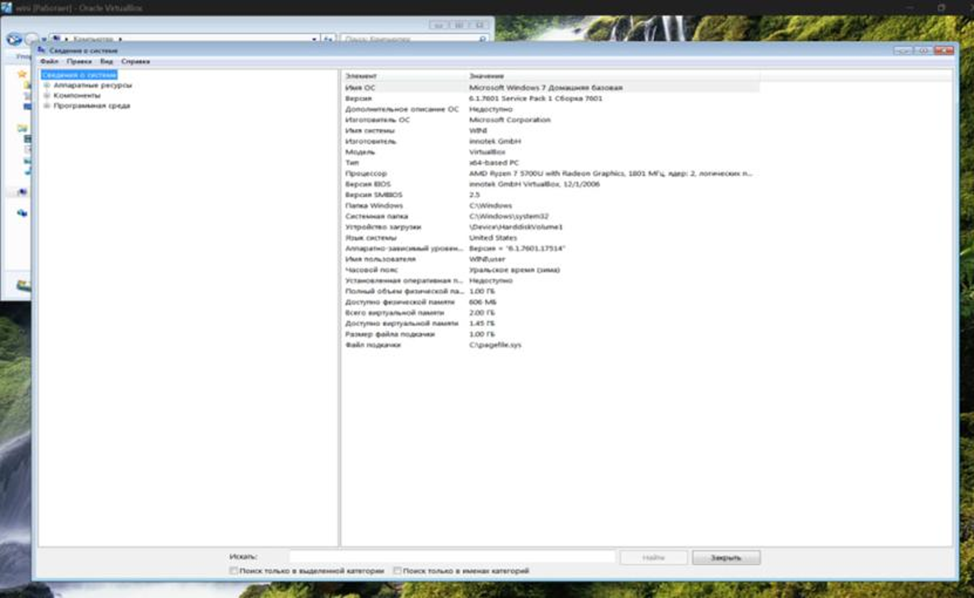

## Установка новых устройств

### Задание 10. Установка нового устройства
1. Чтобы установить устройство, которое Windows 7 не может опознать и установить автоматически, воспользуйтесь мастером установки оборудования.
2. Откройте **Пуск** → **Панель управления** → **Диспетчер устройств**.
3. В открывшемся окне Диспетчера устройств щелкните правой кнопкой мыши по названию своего компьютера (самая верхняя строчка) и в контекстном меню выберите пункт **Установить старое устройство**.

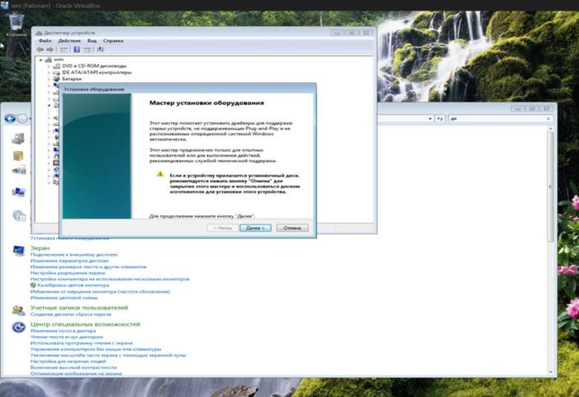

### Задание 11. Включение автообновления
1. Щелкните по кнопке **Пуск** внизу экрана. В раскрывшемся меню перейдите по позиции **Панель управления**.
2. В открывшемся окне Панели управления перейдите в раздел **Система и безопасность**.
3. В новом окне щелкните по наименованию раздела **Центр обновления Windows**.
4. В открывшемся Центре управления с помощью меню, расположенного слева, переместитесь по пункту **Настройка параметров**.
5. В открывшемся окне в блоке **Важные обновления** переставьте переключатель в позицию **Устанавливать обновления автоматически (рекомендуется)**. Щелкните **ОК**.

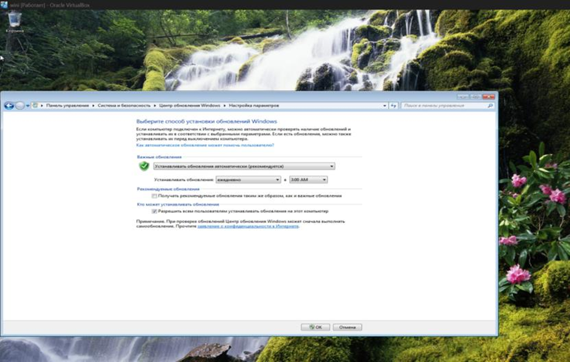