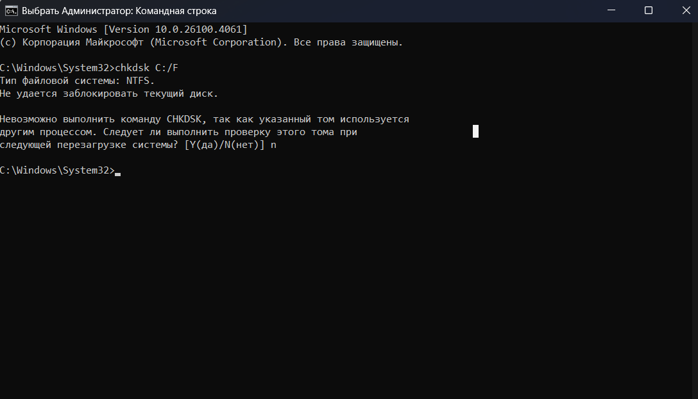
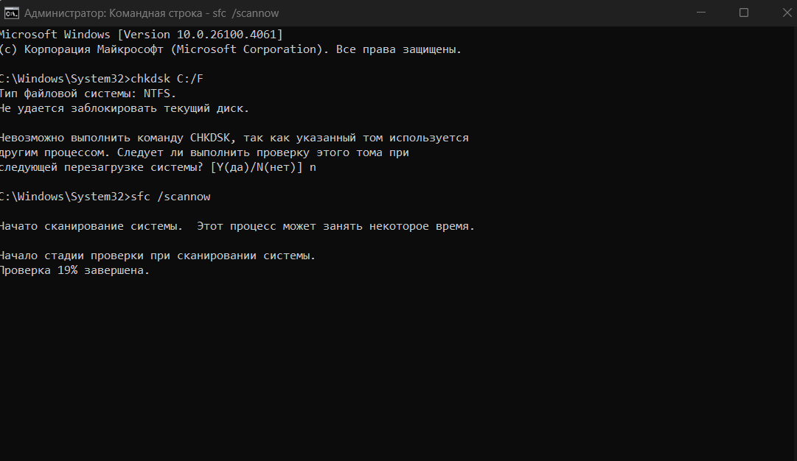
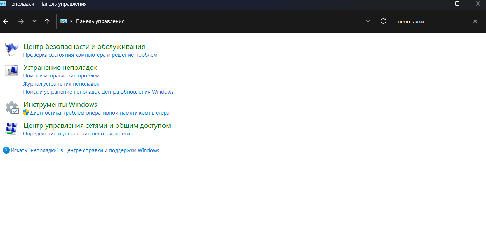
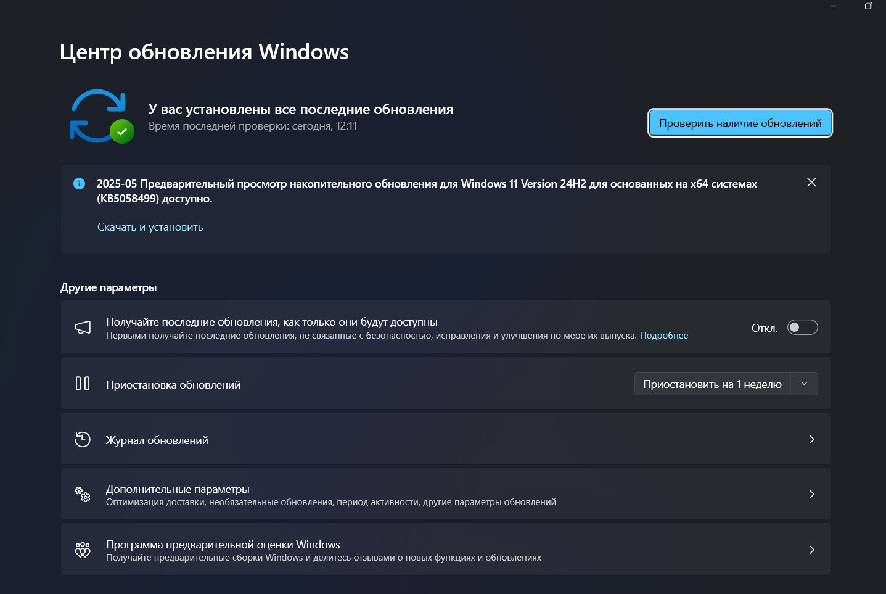

# Практическая работа №4

## Тема
Диагностика и коррекция ошибок операционной системы, контроль доступа к операционной системе
## Цель работы
Научиться осуществлять диагностику и коррекцию ошибок ОС, осуществлять контроль доступа к ОС.
## Приобретаемые умения и навыки
Умение находить и устранять ошибки в ОС.
## Норма времени
2 часа.
## Оборудование
Компьютер с установленным программным обеспечением и подключенный к Internet.

## Ход выполнения работы

### Проверка диска с помощью CHKDSK
**CHKDSK** – служебная утилита, встроенная в операционную систему.  
Предназначение утилиты заключается в восстановлении поврежденных секторов на жестком диске. Также, CHKDSK исправляет ошибки системных файлов.

Проверка командой sfc scannow
Утилита также запускается из командной строки. Для запуска проверки понадобятся права Администратора

### Стандартная диагностика проблем Windows
#### Устранение неполадок в Панели управления
- Это внутренняя программа Windows, позволяющая диагностировать систему на наличие ошибок и поиску решений для их устранения

#### Поиск решений в Центре поддержки
- Средство **Центр поддержки** отслеживает состояние операционной системы, сохраняет отчеты об ошибках и сбоях. Посредством Центра можно находить произошедшие неполадки, исправлять их.

## Контрольные вопросы

1. **Задачи, характеристики и структура системы контроля и диагностики**  
   **Задачи:**
- Обнаружение и исправление ошибок в работе ОС.
- Предотвращение сбоев и повышение стабильности работы системы.
- Повышение безопасности и защита данных.
- Оптимизация работы и увеличение производительности.  
  **Характеристики:**
- Автоматизированность процессов.
- Наличие встроенных и сторонних инструментов диагностики.
- Возможность восстановления системы.  
  **Структура:**
- Встроенные средства диагностики (CHKDSK, SFC, Центр обновлений).
- Логирование ошибок (Журнал событий Windows, Центр поддержки).
- Средства восстановления и отката системы.

2. **Методы диагностики компьютерных систем и комплексов**
- **Внутренние методы** (используют встроенные средства ОС):
    - CHKDSK – проверка диска на ошибки.
    - SFC /scannow – проверка системных файлов.
    - Средства устранения неполадок в Панели управления.
    - Центр обновлений Windows.
- **Внешние методы** (используют стороннее ПО):
    - Victoria, HDDScan – диагностика жёсткого диска.
    - CCleaner – очистка системы от ненужных файлов.
    - Dr.Web CureIt, Malwarebytes – проверка системы на вирусы.

3. **Программные средства контроля и диагностики и их принципы работы**
- **CHKDSK** – проверяет диск на наличие ошибок, исправляет повреждённые сектора.
- **SFC (System File Checker)** – проверяет целостность системных файлов и восстанавливает их.
- **Средство устранения неполадок Windows** – выполняет автоматическую диагностику и предлагает решения.
- **Центр поддержки Windows** – собирает отчёты о сбоях, предлагает исправления.

4. **Классификация программных средств контроля и диагностики и их назначение**
- **Средства проверки файловой системы**: CHKDSK, SFC.
- **Средства анализа производительности**: Монитор ресурсов, Диспетчер задач.
- **Средства поиска и устранения неисправностей**: Встроенные мастеры устранения неполадок.
- **Средства антивирусной защиты**: Windows Defender, сторонние антивирусы.

5. **Функции системы восстановления и классификация средств восстановления**  
   **Функции:**
- Восстановление работоспособности ОС после сбоев.
- Откат системы к рабочему состоянию.
- Защита данных от повреждений.  
  **Классификация:**
- **Встроенные средства Windows**:
    - Точки восстановления.
    - Функция "Вернуть компьютер в исходное состояние".
- **Сторонние программы**:
    - Acronis True Image – создание резервных копий.
    - Recuva – восстановление удалённых файлов.