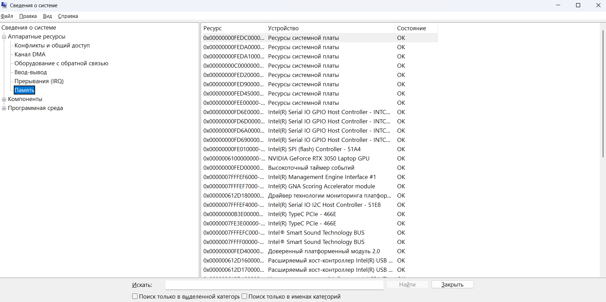
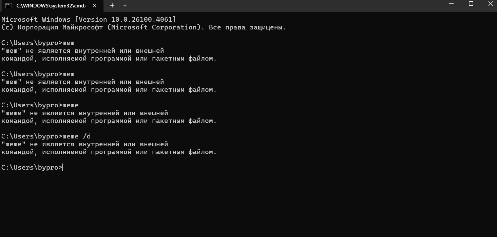
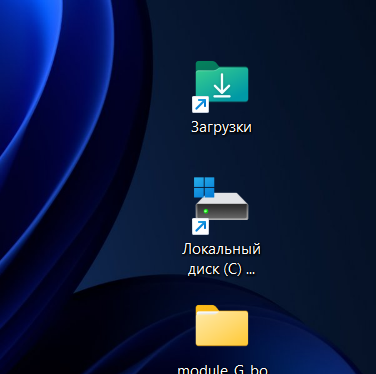
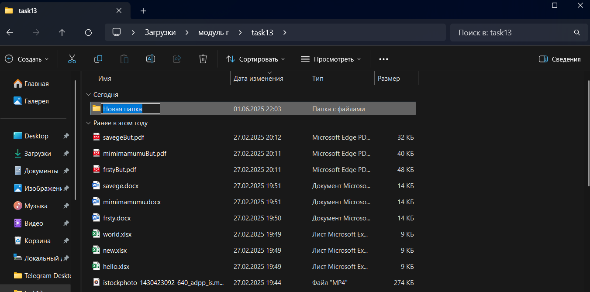
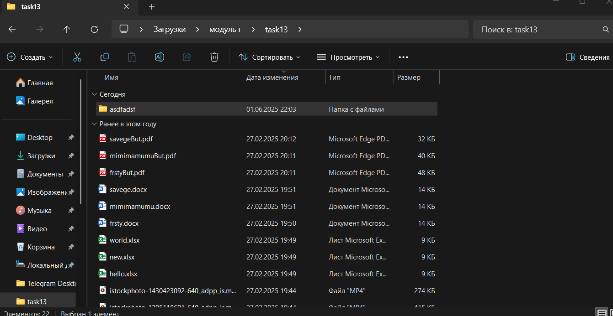
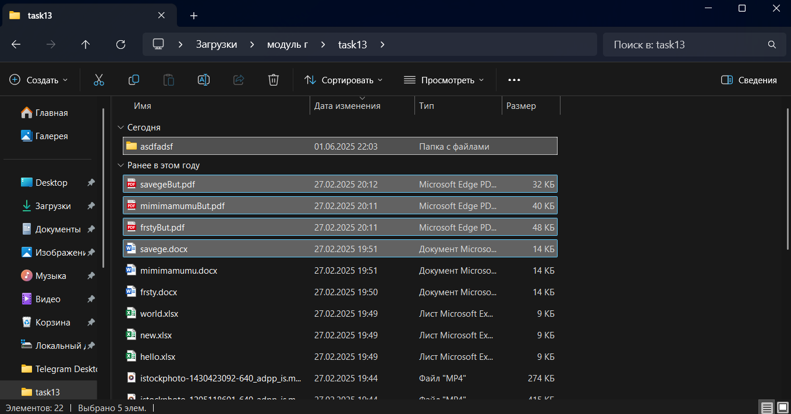
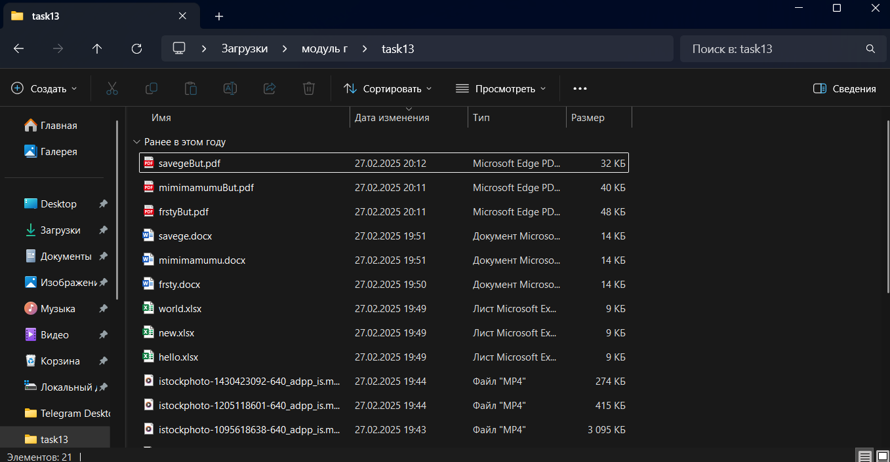

# Практическая работа №5

## Тема
Исследование соотношения между представляемым и истинным объёмом занятой дисковой памяти. Изучение влияния количества файлов на время, необходимое для их копирования.

## Цель
Приобрести практические навыки использования системных программ для получения информации о распределении памяти в вычислительной системе.

## Задания

### Задание 1. Получение сведений об использовании физической памяти

### Задание 2. Изменение размера файла подкачки
Файл подкачки – это область жесткого диска, используемая Windows для хранения данных оперативной памяти. Он создает иллюзию, что система располагает большим объемом оперативной памяти, чем это есть на самом деле. По умолчанию файл подкачки удаляется системой после каждого сеанса работы и создается в процессе загрузки ОС. Размер файла подкачки постоянно меняется по мере выполнения приложений и контролируется ОС.

1. Щелкните правой кнопкой мыши по значку **Мой компьютер** и выберите в контекстном меню строку **Свойства**.
2. Перейдите на вкладку **Дополнительно** и нажмите кнопку **Параметры** в рамке **Быстродействие**.
3. В появившемся окне **Параметры быстродействия** нажмите кнопку **Изменить**.
4. Выберите принцип распределения времени процессора:
    - Для пользовательского компьютера: оптимизировать работу **программ**.
    - Для сервера: оптимизировать работу **служб, работающих в фоновом режиме**.
5. Задайте режим использования памяти:
    - Для пользовательского компьютера: оптимизировать работу **программ**.
    - Для сервера: оптимизировать **системный кэш**.
6. Установите размер файла подкачки:
    - **Исходный размер**: равный размеру физической памяти.
    - **Максимальный размер**: не более двух размеров физической памяти.
7. Нажмите кнопку **Задать** и убедитесь, что новое значение файла подкачки установлено.
8. Щелкните на кнопке **ОК**. Появится сообщение, что изменение требует перезагрузки компьютера. Нажмите **ОК**.

### Задание 3. Получение отчетов о распределении памяти через командную строку
Используя командную строку, получите отчеты о распределении памяти в системе с помощью команды mem. Указанная команда предназначена для вывода информации о распределении оперативной памяти между загруженными программами. Выполнение команды без параметров выводит информацию об объемах свободной и занятой памяти. Ключ /program выводит информацию обо всех загруженных в память программах, включая системные программы. При ключе /debug в отчет включаются данные о внутренних системных драйверах. Просмотрите и проанализируйте отчеты о распределении памяти всеми указанными способами.

### ХОД РАБОТЫ 

1. Создайте на «Рабочем столе» ярлык «Локального диска С:», откройте объект «Компьютер», щелкните правой кнопкой мыши по «Локальному диску С:» выберите команду «Создать ярлык» перетащите вновь созданный ярлык на рабочий стол
2. Аналогично создайте ярлыки часто используемых приложений и документов. перетащите их на рабочий стол

3. Работа с программой Проводник

