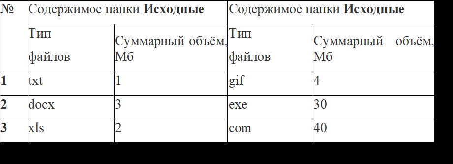
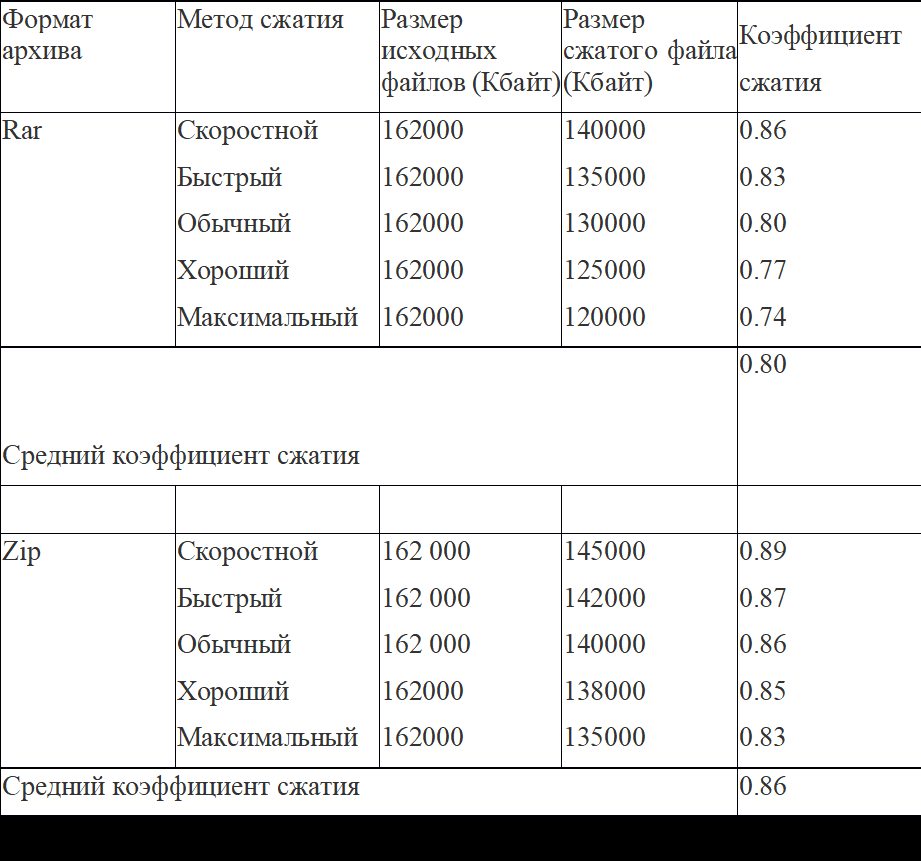

# Практическая работа №6

## Тема
Работа с архиваторами

## Цель работы
Ознакомление с назначением архиватора и возможностями его настройки.

## Задачи работы
Понять принципы работы с программами создания архивов.

## Обеспечивающие средства
- Электронный учебник.
- Конспект лекций.
- Сборник описаний практических работ по «Операционные системы и среды».
- Персональный компьютер.

## Задание
Изучить назначение и принципы работы с настройками архиватора.

## Требования к отчету
Итоги практической работы представить в письменном виде.

## Контрольные вопросы

1. **Назначение архивного файла?**
    - Хранение данных в сжатом виде для экономии места.
    - Объединение нескольких файлов в один.
    - Защита данных (пароли, шифрование).
    - Передача файлов через интернет (уменьшение размера).

2. **Опишите технологию создания архивного файла с помощью WinRAR?**
    - Выделить файлы → ПКМ → "Добавить в архив…" → Выбрать формат (RAR/ZIP), метод сжатия, имя → OK.

3. **Опишите извлечение файлов в режиме графической оболочки WinRAR?**
    - Открыть архив → Выделить файлы → "Извлечь…" → Указать путь → OK.

4. **Опишите извлечение файлов в режиме командной строки? winrar x archive.rar C:\destination\**

5. **В чем разница и преимущества форматов RAR и ZIP?**
- **RAR**: Лучшее сжатие, поддержка многотомных архивов, восстановление данных.
- **ZIP**: Более распространён, быстрее, но хуже сжимает.

6. **Какое действие выполняется при нажатии комбинации Alt+L?**
- Показывает/скрывает панель дерева папок.

7. **В чем смысл команды "Добавить информацию для восстановления"?**
- Добавляет данные для восстановления повреждённого архива.

8. **В каких случаях используется команда "Восстановить архив" и её возможности?**
- Используется при повреждении архива → пытается восстановить данные.

9. **Профили архивации - в чем заключается смысл данных настроек?**
- Предустановленные настройки для быстрого выбора параметров сжатия.

10. **Объясните смысл создания самораспаковывающихся файлов?**
- Архив с расширением .exe, который распаковывается без WinRAR.

11. **Какие типы лицензий на использование WinRAR предусмотрены? Опишите кратко каждую.**
- **Пробная (40 дней)**: Полный функционал, затем требуется покупка.
- **Корпоративная**: Для организаций.
- **Персональная**: Для частных лиц.

12. **Опишите процедуру лицензирования программы?**
- После установки ввести лицензионный ключ (покупается на сайте RARLAB).

## Вывод
В ходе работы изучены возможности архиватора WinRAR: создание архивов, настройка методов сжатия, сравнение форматов RAR и ZIP. Наибольшее сжатие обеспечивает RAR с методом "Максимальный". ZIP менее эффективен, но более универсален. Самыми хорошо сжимаемыми типами файлов оказались текстовые (txt, html), а хуже всего — исполняемые (exe, dll).