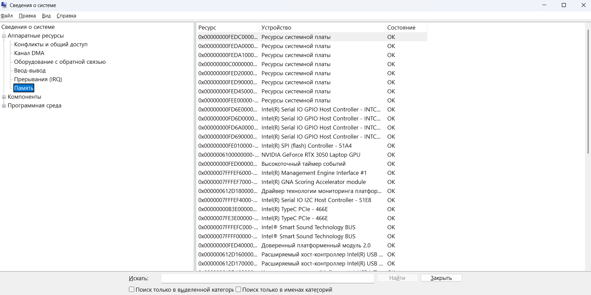
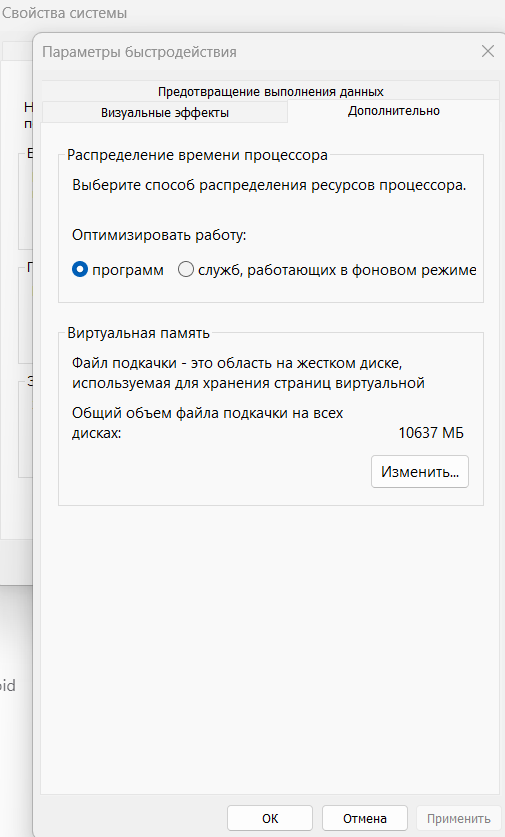
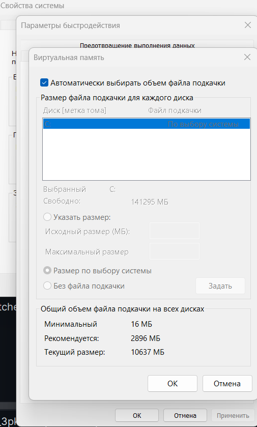
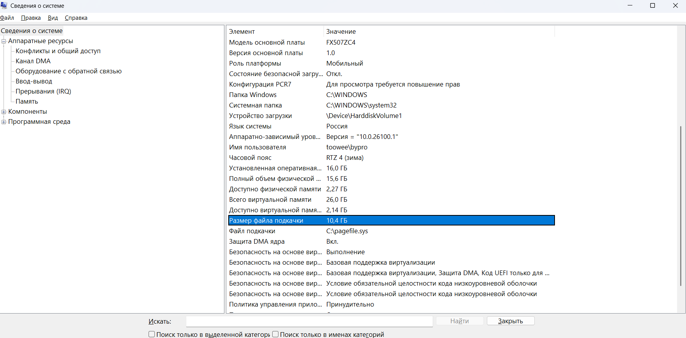

# Практическая работа №7

## Тема
Управление памятью

## Цель работы
Приобрести практические навыки использования
системных программ для получения информации о распределении памяти в вычислительной памяти.

## Ход работы
- Ознакомиться с краткими теоретическими сведениями.
- Выполнить задания.
- Ответить на контрольные вопросы.
- Оформить отчет.

## Практические задания

### Задание 1. 



### Задание 2. Изменение размера файла подкачки.
  Файл подкачки - это область жесткого диска, используемая Windows для хранения данных оперативной памяти. Он создает иллюзию, что система располагает большим объемом оперативной памяти, чем это есть на самом
  деле. По умолчанию файл подкачки удаляется системой после каждого сеанса работы и создается в процессе загрузки ОС. Размер файла подкачки постоянно меняется по мере выполнения приложений и контролируется ОС. Для самостоятельной установки размера файла подкачки нужно выполнить следующую последовательность действий:
1. `sysdm.cpl` в win+r;
2. перейти на вкладку Дополнительно и нажать кнопку Быстродействие;
3. в появившемся окне Параметры быстродействия нажать
  кнопку Изменить.




  
### Задание 3. 
Используя командную строку, получите отчеты о
  распределении памяти в системе с помощью команд
```shell
  wmic os get FreePhysicalMemory
  wmic os get FreeSpaceInPagingMemory
  wmic os get FreeVirtualMemory
  wmic os get MaxProcessMemorySize
  wmic os get SizeStoredInPagingFiles
  wmic os get TotalSwapSpaceSize
  wmic os get TotalVirtualMemorySize
  wmic os get TotalVisibleMemorySize
```

Это связано с тем, что Microsoft удалила WMIC (Windows Management Instrumentation Command-line) из некоторых версий Windows 10 и Windows 11, начиная с определённых сборок.


## Контрольные вопросы

1. Зачем нужна оперативная память компьютеру? Нужна для быстрого
доступа к данным и программам, которые использует процессор. Чем больше
RAM, тем плавнее работает система.
2. Что такое виртуальная память, ее назначение? Это "дополнительная"
   память на диске (файл подкачки / swap), которая используется, когда не
   хватает RAM. Медленнее, но предотвращает зависания.
3. Какие алгоритмы распределения памяти использует современная ОС
   Windows, а какие ОС Linux?  
   • Windows: Страничная организация, CLOCK (Second Chance), сжатие
   памяти, динамический файл подкачки.
   • Linux: Страничная организация, CLOCK/LRU, настройка swappiness,
   swap-раздел, OOM Killer.
   Разница: Windows чаще использует файл подкачки, Linux — swap-раздел
   и гибкие настройки.