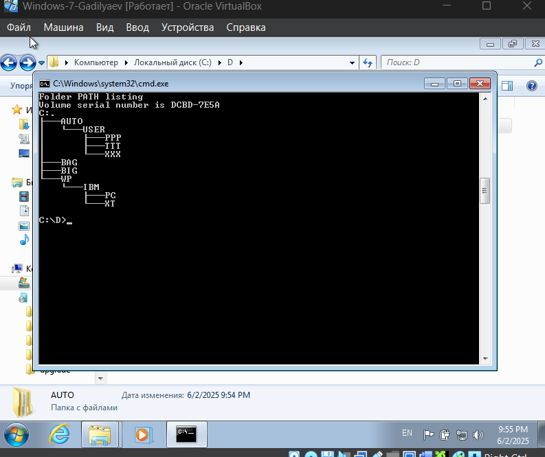
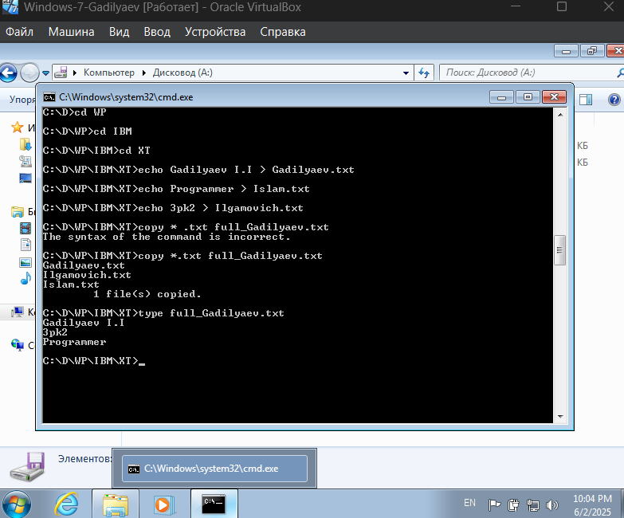

# Практическая работа №8

## Тема
РАБОТА В КОМАНДНОЙ СТРОКЕ

## Цель работы
Зкрепление знаний по файловой системе организации данных и приобретение навыков работы в командной строке

## Ход работы
- Ознакомиться с краткими теоретическими сведениями.
- Выполнить задания.
- Ответить на контрольные вопросы.
- Оформить отчет.

