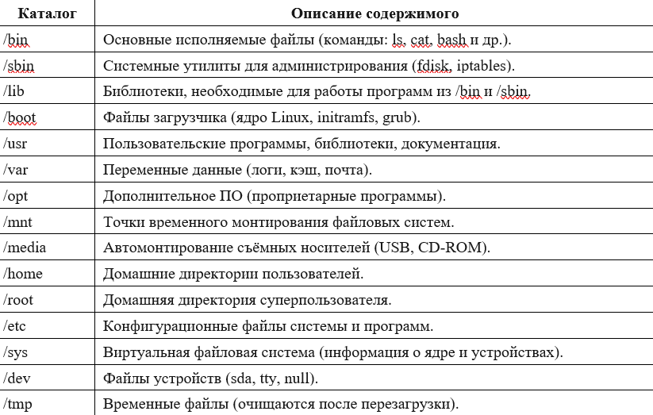

# Практическая работа №9

## Тема
Работа с программой «Файл-менеджер Проводник». Работа с файловыми системами и дисками

## Цель работы
Исследование структуры каталогов ОС Linux, изучение системы логирования, получение навыков чтения системных журналов, применение консольных команд grep, tail, head, ca

## Ход работы
- Ознакомиться с краткими теоретическими сведениями.
- Выполнить задания.
- Ответить на контрольные вопросы.
- Оформить отчет.

1. Получили права суперпользователя: su -
2. Изучили файловую систему и заполнили таблицу (использовали команду ls -la <путь>):
   
3. /var/log
   
4. Последние ошибки
   
5. Архивный журнал
   
6. фильтрованный файл без сообщений ядра
   
7. Просмотр конца полученного файла
   
8. Интерактивный просмотр журнала в реальном времени
   
9. Журнал регистрации пользователей
   
10. Графическая утилита draklog
   

